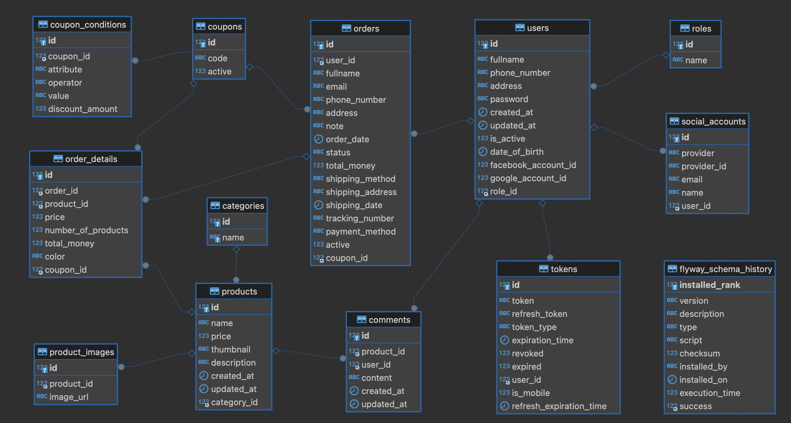

# Shopp App - Backend 
Backend system provides restful API for web or mobile.

[](https://app.circleci.com/pipelines/circleci/WpJpWzbAX4Dvhh2AjRnJmX/X6V4xLymFHgq4YEPN1Aiia)

[](https://sonarcloud.io/project/overview?id=hoangtien2k3_shopapp-backend)
[](https://sonarcloud.io/project/overview?id=hoangtien2k3_shopapp-backend)
[](https://sonarcloud.io/project/overview?id=hoangtien2k3_shopapp-backend)
[](https://sonarcloud.io/project/overview?id=hoangtien2k3_shopapp-backend)

In this project I'm demonstrating you the most interesting features of [Spring Cloud Project](https://spring.io/projects/spring-cloud) for building microservice-based architecture.

## Introduction 💗💎❤️

Welcome to the backend component of `shopp-app backend (e-ecommerce)`. This Java Spring boot backend is designed to
handle the server-side logic and data processing for my application.

## Prerequisites 🌀

✅ Before you begin, ensure you have met the following requirements:

- Java Development Kit `(JDK) 17` or higher installed.
- Build tool (`Maven`) installed.
- Database system (e.g., `MySQL8`) set up and configured.
- Liquibase Migration Database `MySql8`
- Reactive Programming with WebFlux Reactor Spring Boot.
- Hibernate, JPA
- Docker build
- Restfull API
- PostMan Testing API and Client.
- Send message and receiver using Kafka server, Zookeeper, Broker.
- Redis cache database 
- Flyway migration database version 

## ✅Features

- Provides all the necessary and most basic APIs of a website or mobile app for Shopp App and E-Ecommerce

## Getting Started

Follow these steps to set up and run the backend:

1. Clone the repository:

```bash
   git clone https://github.com/hoangtien2k3/shopapp-backend.git
```

#### 1. Navigate to the project directory:

```bash
  cd shopapp-backend
```

#### 2. Build the project:

```bash
  # Using Maven
  mvn clean install
  
  # Using Gradle
  gradle build
```

#### 3. Configure the database:

- Update `application.yml` with your mysql database connection details.

#### 4. Run the application:

```bash
  # Using Maven
  mvn spring-boot:run
```

## Technologies Used

- `Java`: The primary programming language.
- `Spring Boot`: Framework for building Java-based enterprise applications.
- `Maven/Gradle`: Build tools for managing dependencies and building the project.
- `Database`: Choose and specify the database system used (e.g., MySQL8).
- `Other Dependencies`: List any additional dependencies or libraries used.
- `Cache`: Using redis cache db

## Databaes Mysql8


## Swagger-ui

[http://localhost:8080/swagger-ui/index.html](http://localhost:8080/swagger-ui/index.html)


## API Documentation

Document the API endpoints and their functionalities. You can use tools like `Swagger` for
automated `API documentation`.

## Contributing

If you would like to contribute to the development of this project, please follow our contribution guidelines.

## License

This project is licensed under the [`MIT License`](LICENSE).

```text
MIT License
Copyright (c) 2024 Hoàng Anh Tiến
```

## Contributors ✨

<!-- ALL-CONTRIBUTORS-LIST:START - Do not remove or modify this section -->
<!-- prettier-ignore-start -->
<!-- markdownlint-disable -->
<table>
  <tr>
    <td align="center"><a href="https://www.linkedin.com/in/hoangtien2k3/"><br /><sub><b>Hoàng Anh Tiến</b></sub></a><br /><a href="https://github.com/hoangtien2k3/news-app/commits?author=hoangtien2k3" title="Code">💻</a> <a href="#maintenance-hoangtien2k3" title="Maintenance">🚧</a> <a href="#ideas-hoangtien2k3" title="Ideas, Planning, & Feedback">🤔</a> <a href="#design-hoangtien2k3" title="Design">🎨</a> <a href="https://github.com/hoangtien2k3/news-app/issues?q=author%hoangtien2k3" title="Bug reports">🐛</a></td>
  </tr>

</table>

<!-- markdownlint-restore -->
<!-- prettier-ignore-end -->
<!-- ALL-CONTRIBUTORS-LIST:END -->